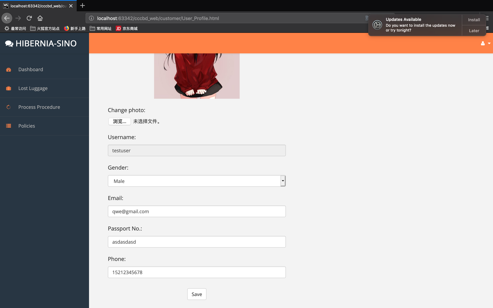
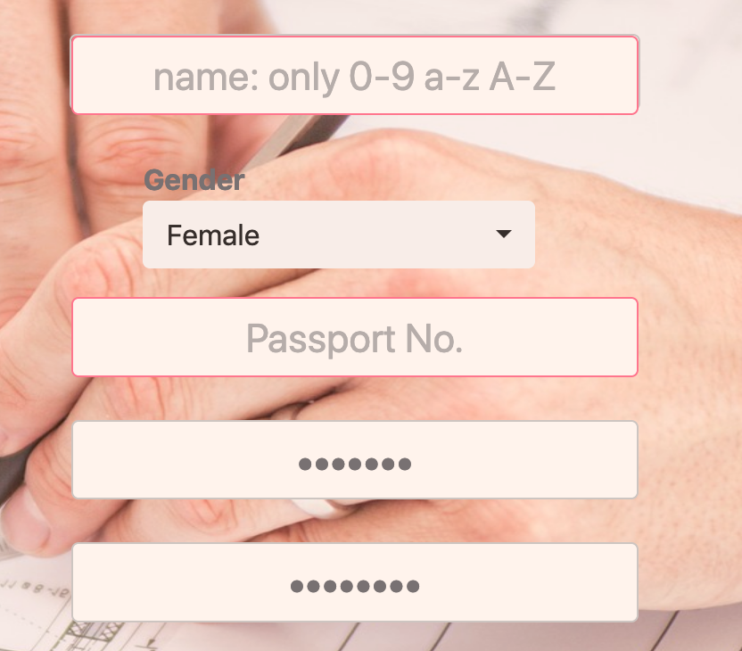
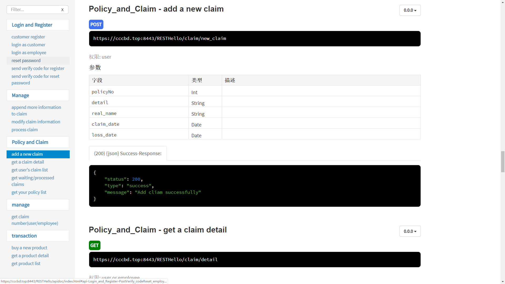

<style>
h1
{
	text-align:center;
}
p
{
	font-family: Times New Roman;
    font-size: 12pt;
    line-height:1.5;
}
figcaption {
    font: italic smaller sans-serif;
    padding: 3px;
    text-align: center;
    color: DarkGray;
}
.CodeMirror-code{
        font-size: 8pt;
}
figure{
    text-align:center;
}

[TOC]


# 1. ABSTRACT

In this document, we talk about the detail about our Insurance project. It includes how our team to organize and how to teamwork and deal the development process, and the technical detail behind the project. Lastly, we make a brief conclusion about the project and analyze our gain and loss at this time.


# 2. INTRODUCTION

## 2.1 What does the system do

The system constructs an online platform for Hibernia-Sino Travel Insurance Company, which reduces the work-flow from dated desktop software systems to the cloud and develops online user interface for operations of customers and employees.  This allows customers to update their details, check all policies, register claims on-line and so on. The system can also work on multiple platforms supplying different kinds of language with good security, reliability and ease of use.


## 2.2 The plan of the system

Firstly, we design and work out 4 work packages and each group member is the package manager of a different package. After discussion, we generally determine the Gantt chart for the system which presents the divided work we should finish each week as planned. 

As for PC desktop terminal, we plan to construct the framework of cloud end and databases first and make web pages for login interface and register etc at the same time. Then, after finishing the correct connection of the front end and back end, we do the elementary functional construction---Lost baggage claim processing. After that, we will add more functions like purchasing policies, check policies, changing language and so on. At last, we will do some testing and enhance security. 

As for the packing project, we decide to use Electron for cross-platform presentation. 

As for phone terminal, we plan to use adaptive screen resolution running as a website and do some modification. In this way, we can ensure the style and overall arragement are consistent with the computer terminal.

<figure>
  <div align='center'>
  
  <figcaption>Fig.1 Gantt Diagram</figcaption>
</figure>


# 3. GROUPWORK

## 3.1 How to achieve the goals together

As for the teamwork, we intend to have high-efficient teamwork. To achieve this, we have three aspects of how to reach the goals together.

- Clear Responsibility

  A team is composed of individuals. Individuals in a team often have different experiences, personalities and programming levels. Before the official start, we firstly carry out a reasonable division of labour which combines each person's characteristics and hobbies, bring into full play the strengths of each team member. If the work is not pleasant and smooth, the efficiency will be low. After the division of labour is completed, each team member's corresponding responsibilities are determined.

- Efficient Communication

  After the completion of the division of work, the team will start to work, it must ensure the smooth flow of information within the whole team, especially among the team members whose work are related to each other. When problems are found, they need to be discussed in time to avoid unnecessary time waste. However, software development itself is a kind of work that needs to be focused and quiet, and many temporary interruptions will lead to the stagnation of development ideas, so our team have discussions at a fixed time every week. And fixed time will also let everyone form a habit so that the efficiency can be enhanced.

  At each meeting, we always discuss these aspects as flowing:

  - Conclude from last week’s work or presentation, and find ways to overcome.

  - Set goals of this week, including the integral goal and each team members' goal for this week.

  - Solve some difficult problems that cannot be solved by one team member.

  - Write the meeting agenda.

- Appropriate Tools

  Tools are of great importance for efficient teamwork.
The approach that most teams are taking right now is to introduce collaborative software that works for the entire team. With clear responsibilities and efficient communications, if team members are supported and coordinated by appropriate, team collaboration tools, this project will be carried out more smoothly.
  So we use GitHub to develop the project as it can provide each member to contribute for their own part on their personal computer and it is easy to solve the conflicts by merging the code. 
Also, we use MarkDown to write our documents because it can be modified by more than one team member at the same time, and after everyone is done their part just merges it on GitHub, it is very convenient for a team to write documents. As our project is a software project, we need to write some code in the document, and Markdown makes it is extremely easy and straightforward to insert the code into the document.

The team is an integrity, not a set of individuals. We should always remember that the ultimate effectiveness of the team depends on the lowest efficiency of the team. Reasonable division of labor is the prerequisite to prevent the occurrence of problems, and establishing of an efficient communication mechanism is an effective way to find problems.


## 3.2 Divide of work

Our team divided the project basically into three main parts: front-end part, back-end part and mobile-end.

* Front-end

  Contributors: Bi Yue, Du Xuanxuan, Cao Ziyi

  Main work: The design of the interfaces and the logic of the system, for example, what information does a customer need to apply for an account, what should a customer do if he/she forgets his/her password, what are the steps when a customer applies for a lost luggage and so on.

* Back-end

  Contributor: Chen Jingrui

  Main work: The design of the application's back-end services and business logic and manage the whole system's architecture and technology.

* Mobile-end

  Contributor: Chen Jin

  Main work: The design of mobile app by packaging the front-end web pages and system logic and modifying the layout to fit various phone screen resolutions.
  
  


## 3.3 Problems

Rather than individuals who can decide all choices by themselves, we work as a group which means we have to make almost all decisions after getting everyone's approval in order to get the success of the whole system.  Many people participating in the discussion represent more collision among different opinions, which will create a lot of problems. Although effective division, communication and tools have avoided many problems, we still confront several some issues. 

- Lack of communication between weekly meeting

  We have fully communication during group meeting every week, dividing tasks, dealing with difficult problems together. However, we hardly discussed the process of work during that week (between weekly meeting) at first. We initially thought that we needed to give everyone independent time to do their work because they had other things to do besides the project, but things went wrong. Some members may be encountered difficulties in their work, but they kept the question to themselves and couldn't solve it out until next week meeting, which leads to delays in the task and the group efficiency would be reduced. 

- Mistakes about merger of git

  During the development of the system, we found files in each member's local git repository of git were different from each other, some were not updated to the latest and some files even lost in contributors' computer. We were confused about this chaos and feared that our efforts will be in vain and influenced the final version of the system. 


## 3.4 Solutions

In group work, we need to constantly solve problems. In view of the above two problems, we have come forward with solutions.

- Helping and monitoring mechanism 

  In order to solve the problem of someone delaying work or not solving the problem in time, we adopt the helping and monitoring mechanism between several group members.  We divide the group into several small groups such as front end for 2 people, the back end for two people etc and assign tasks to each small groups. In this way, people responsible for the same task cannot only monitor and urge others to do the work but help each other deal with problems as well.  In other words, people who have the same goal for the whole task can solve more problems and thus improve their work efficiency.

- Good solution about git merge in WebStorm/GitKraken

  Considering the drawback in the primary cmd command line, we choose to use other better software to do git operations. WebStorm or GitKraken are good choices, which cannot be only upload files, modify content to the remote git repository and update the local git repository, but also present the process flow and chart of each modification, which is clear and concise. This approach addresses the difficulty of seeing the process in each merging. Besides, WebStorm can also adjust cut and overwritten coverage to avoid the computer directly selecting the merged content by default and carrying out an internal operation to get the result we do not want. In this way, files can be synchronized among members' local repository and git can merge correctly.

  <figure>
    <div align='center'>
    
    <figcaption>Fig.2 Using Git</figcaption>
  </figure>


# 4. TECHNICAL IMPLEMENTATION

## 4.1 Front-end

### 4.1.1 Logic

- The logic of customer-end.

  First, the customer needs to sign in, if the customer doesn’t have an account he/she can apply for one of the applying interface. The system will send an Ajax to the back-end for a login request, and then the back-end will return to a state code. In the customer_homepage interface, customers can apply for lost luggage, buy new policies and check all the policies they have already bought. 
In the lost luggage interface, customers can write claims by filling the forms, they need to input the date when they lost it, their real name, and their policy number. Also, they can find the processing policies if they have more than one claim.
  

In the select product interface,  customers can see all of the insurance kind and they can select one by pressing the productNo, and then they will enter the buying interface where they can pay the bill. Only after buying the policy, customers can apply for lost luggages.

 

- The logic of the employee-end.

  Every employee will be given an account at the very beginning when they work in the company. Like the customer-end, they need to sign in and the system will send an Ajax to the back-end for a login request, and then the back-end will return to a state code. 
In the dashboard, the employee can see the number of processed and unprocessed claims. To achieve this, unprocessed will get the number of all the claims which state is ‘waiting’, and the process will get the number of the rest of them. To process the claims, the employee needs to click the policyNo and then it will skip to the processing interface. In this interface, the whole details will be displayed to the employee and there are three buttons under the details, approve, deny, and ask for more information. Click the button and then will set the state to this claim, then skip to the Unprocessed interface, the number of unprocessed will minus one. 
  
  
  


### 4.1.2 Connection between the front-end and the back-end

#### 4.1.2.1 Outline 

<figure>
  <div align='center'>
  
  <figcaption>Fig.3 Connection Outline</figcaption>
</figure>

The connection between front-end and back-end we divide functions into 3 different cases, just like the diagram shows above. Get objects with parameters, no parameters, and return a message.

<figure>
  <div align='center'>
  
  <figcaption>Fig.4 Functions with parameters</figcaption>
</figure>


we usally use these functions to get one object contains our desired information. in the client-side we need specific different claims, the number of claims and product's details. the problem in this stage, is we should hava correct api and clearly thought, using console.log print out the object to check. others funcitions, we only implement this function and using in corrent div to get we goal.

#### 4.1.2.3 Functions that have no parameters, and only request for database information

In order to obtain many lists. We send a request to url and return a list that contains all the objects to meet the constraints

<figure>
  <div align='center'>
  
  <figcaption>Fig.5 Functions without parameters</figcaption> 
  </div>
</figure>


In this function, we create a list to store the information we selected and send to url. After receiving lists in html, first we generate thread, and the append body, dynamic generation of table.
Following is dynamic generation options to offer the customer to select your policy in creating a new claim. 

```javascript
 function addOptions(selector) {
            $(selector).empty();
            let xmlhttp = new XMLHttpRequest();
            let url = "https://cccbd.top:8443/RESTHello/policy/my_policies";
            xmlhttp.withCredentials = true;
            xmlhttp.open("GET", url, true);
            xmlhttp.send();
            xmlhttp.onreadystatechange = function () {
                if (xmlhttp.readyState === 4 && xmlhttp.status === 200) {
                    let myArr = JSON.parse(xmlhttp.responseText);
                    var columns = addAllColumnHeaders(myArr, selector);
                    var row$ = $('<select/>');
                    for (var i = 0; i < myArr.length; i++) {
                        row$.append($('<option/>').html(myArr[i][columns[0]]+" "
                            +myArr[i][columns[1]]).attr('value',myArr[i][columns[0]]));
                    }
                    $(selector).append(row$);
                    row$.attr('name', 'policyNo')
                }

            };
        }
```

<figure>
  
  <figcaption>Fig.6 Policies Selector</figcaption>
</figure>


<figure>
  
  <figcaption>Fig.7 Types of Policies</figcaption>
</figure>


#### 4.1.2.4 Return a message telling us whether succsss

Here is our sending function, different from before. We need to send information to database, username and password. Database executeQuery and check whether this user has registered. 
The register is the same as login. In HTML, getElementById the user input. In JSON, package information as value of a specific key name. Add a new claim, process claim(employee check claim), after reading employee feedback, user append more information to the detail.

<figure>
  
  <figcaption>Fig.8 Sending Functions</figcaption>
  </div>
</figure>


Register is same as login. In html, getElementById the user input. In JSON, package information as value of specific key name. Add a new claim, process claim(employee check claim), after read employee feedback, user append more information to the detail.


#### <font color=#FF0000>4.1.2.5 Security guarantee</font>

<font color=#FF0000>During this process, we need a mechanism to protect our data during the transmission, so we register an SSL/TLS certificate in Let's Encrypt and use it to encrypt our data transmission. After deploying the certificate, all data transmission would be encryption and protection, so avoid the eavesdropping or tampering. Besides, when user's password be transmitted to services, we would use sha384 cryptographic hash function to hash that password then save to database, this hash function is irreversible, so it eliminates the chance to let employee get users' password.</font>

<figure class="half">
  
  
  <figcaption>Fig.9 SSL certificate</figcaption>
</figure>


### <font color=#FF0000> 4.1.3 Feedback on front-end and improvement</font>

<div>
  <p style="color = #FF0000"><b>1. The improvement of personal information</b></p>
    <p>
     <ul>
    <li> Disadvantages / advice: <br>User Profile cannot be clicked, it should display the personal information of customer.
  	</p>
  	<font color = 'red'><li>Improvements:
    <br>We add this function as following pictures. 
</div>


<figure class="half">
  
  
  <figcaption>Fig.10 User Profile</figcaption>
</figure>


<div>
  <p style="color = #FF0000"><b>2. The improvement of invisible password</b></p>
  <p><ul>
    <li>Disadvantages / advice: <br>Buttons and some prompts are too small. The entrance of personal information at the top right of the page is also slightly smaller.
The password is displayed in clear text. For security, it is expected by users to display the password in a hidden form.
  </p>
  <div align='center'><p>
  <figcaption>Fig.11 Invisible password</figcaption>
  <li><font color = 'red'>Improvements:
    <br>We change the input type of 'password', and change its css similar with others.</font></p></div>


<div>
  <p><b>3. Development of changing language in using the product</b></p><ul>
  <p><li>Disadvantages / Advices: <br>1. There is only one language of the images’ button on the main interface.
    <br>2. User should choose the language by himself/herself, but not automatically detect the system environment or the using record.
  <br>
    <br>
    <font color = 'red'><li>Improvements:
    <br>1. We think that multiple buttons will cause confusion to customers, one button is more clear.
<br>2. As for the second disadvantage, we improved it. Now when customers enter the interfaces again it will remember the last language choice. </p>
  </div>


<div>
  <p><b>4. Development of user looking for help</b></p><ul>
  <p><li>Disadvantage / Advice: <br>  If user meet problems, he cannot find solutions or get help by using user's interface.</p>
  <p><font color = 'red'><li>Improvements:
    <br>If customers have problems and need some help, they can click ‘Contact Us ’ then the system email box will open automatically. What’s more, the address will be filled with help@cccbd.top, customers can send problems to our company directly. 
</font></p>
  </div>


## 4.2 Back-end

This section would describe the back-end's technology detail, the process of how we build this back-end server, and why we choose these technology stacks.


### 4.2.1 Technology overview

In the back-end, the main design rule we followed is the microservices architecture, the core concept of our design is to build a series services and provided to front-end by RESTful API, and let the front-end application decide how to use them to process business logic.
<figure>
  <div align='center'>
  
  <figcaption>Fig.12 Restful apis figure</figcaption>
</figure>


This design pattern clearly delimits the edge between front-end and back-end(and delimit the two teams' developing process, so we can separate the back-end and front-end code into two different project folder), and transfer the responsibility of design business process to front-end team, so hugely reduce server compute load. In the meanwhile, we set access control for the whole system, every API has a permission requirement, with these fine-grained restrictions, we can confidence said our system don't exist any privilege escalation problem. Besides, this design symbol gives front-end application fully scalability, we can even use different languages to implement the client logic without changing the back-end, and this trait makes the multi-platform development to become much easier.


### 4.2.2 System architecture detail

In specific practice, we decide to use the RESTEasy framework to start the development of back-end, we build many necessary micro applications which provide different function interfaces, and use tomcat as container to running with Mysql in DigitalOcean could services, and then we through Cloudflare's global CDN to deliver services to everywhere in the world.

<figure>
  <div align='center'>
  
  <figcaption>Fig.13 System architecture graph</figcaption>
</figure>


### 4.2.3 The reason for choosing these technology stacks

Before we start developing the project, we firstly analyze the requirement of this system, and these features below we found are important in our project:

* Security
   As an insurance application and related to money, the security of this project is a major aspect we need to concern, we should never let user's information be leak or theft, so we need a good way to encrypt our information both in transmission and storage.

* Reliability

  Because the application's sensitivity, we also need to keep the system's stability, that means the system needs to be high scalability and flexibility(can easily run on distributed services).

* Ease of use

  We know that the man-machine interaction is a major point the nowadays application needs to consider. An elegant UI design is a key to attract users.

* Portability

  This project needs to work on both mobile and desktop. The portability is also a point we need to consider, writing code to two or more platform is not an easy task.

* Globalization ability

  Because this application is mainly designed for transnational business, we should not only make the application can support multi-language but also need to make users everywhere could get fast access speed.

And after thinking about this question, we gradually design and discuss the whole system and finally make it can satisfy these requirements.

### 4.2.4 Develop process

At the starting of the project, we firstly want to work together in the back-end development, but because the lacking of back-end develops experience and for better divide the work, we finally decide to make an individual sub-group for the responsible to do technical choosing and back-end developing. And next, by following the DevOps way, our team through continuous communication between front-end group and back-end group, and summarize the function required in the back-end. Then, we could build the required functions and provide them as APIs and write a document to let front-end group use these functions and build the application.

Our project's API website build by APIdoc(<https://cccbd.top:8443/RESTHello/apidoc/index.html>):

<figure>
  <div align='center'>
  
  <figcaption>Fig.14 API document</figcaption>
</figure>


## 4.3 Mobile-end

This section introduces the mobile-end construction plan, as well as the technical details used to implement the mobile-end and the fixes for the corresponding issues.

### 4.3.1 Technical Overview

The method of constructing mobile-end is using Cordova to package the front-end web files into the web app. Cordova is a platform for building mobile apps using HTML, CSS and JS. We can think of Cordova as a container for connecting our web applications to native mobile features. The construction progress of the mobile terminal follows the development progress of the front-end. As each front-end version is updated, the mobile-end will update and maintain accordingly, and make corresponding adjustments.

<figure>
  <div align='center'>
  
  <figcaption>Fig.15 Documents distribution in mobile-end</figcaption>
</figure>


Currently, we have built a web app for the Android platform and will create a web app for the IOS platform in the future.


### 4.3.2 Cordova's environment configuration requirements

Cordova's development environment requirements are quite demanding. In addition to JRE, JDK and other Java development requirements environment, also need NodeJS and NPM. NodeJS is the platform that Cordova needs to develop and package web files. For the development of the Android platform, you also need the corresponding Android SDK for the Cordova version. For the development of the future IOS platform, XCode configuration is also required.


### 4.3.3 Mobile-end layout correction

When testing the web file package completion, we encountered a problem that the layout could not be displayed properly, resulting in a disordered mobile interface. The reason for this is that the layout file required for the web version display does not apply to the mobile terminal. The solution to this is to modify the CSS layout file in the Cordova project to make it suitable for mobile platforms.


# 5. Conclusion

Above are all of the project information that CCCBD company applies for Hibernia-sino Company. According to our group condition, we separate into three groups. All of us were done our job well and on time. 
