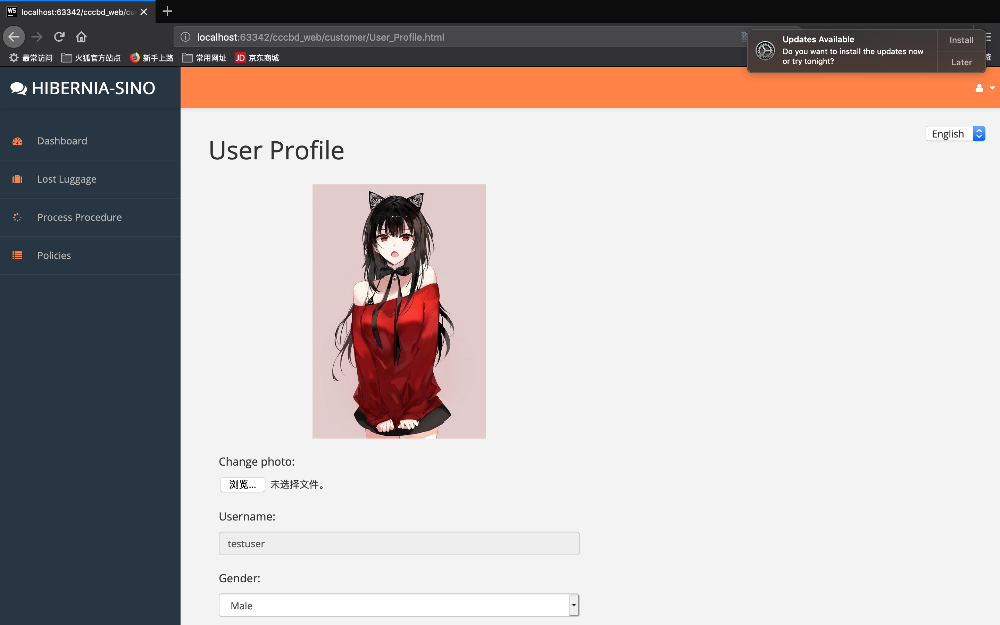
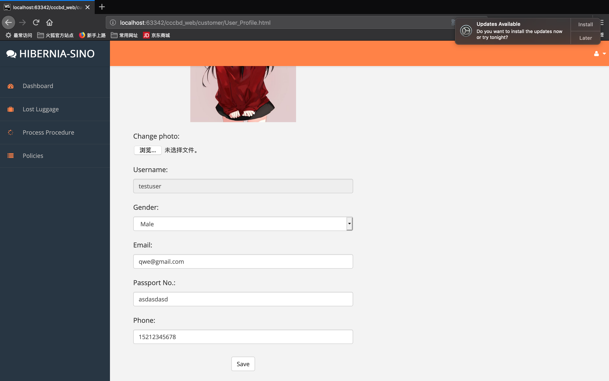
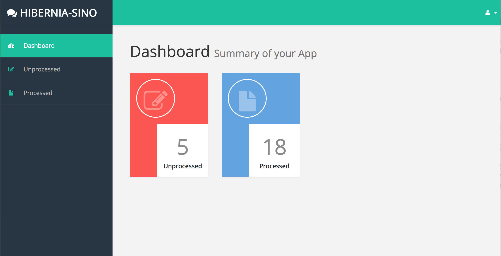
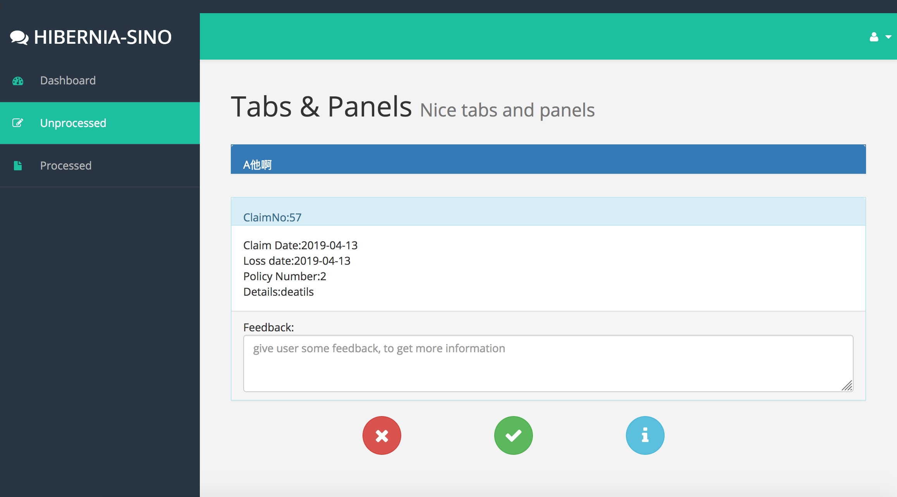
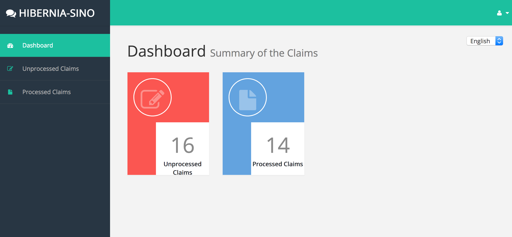
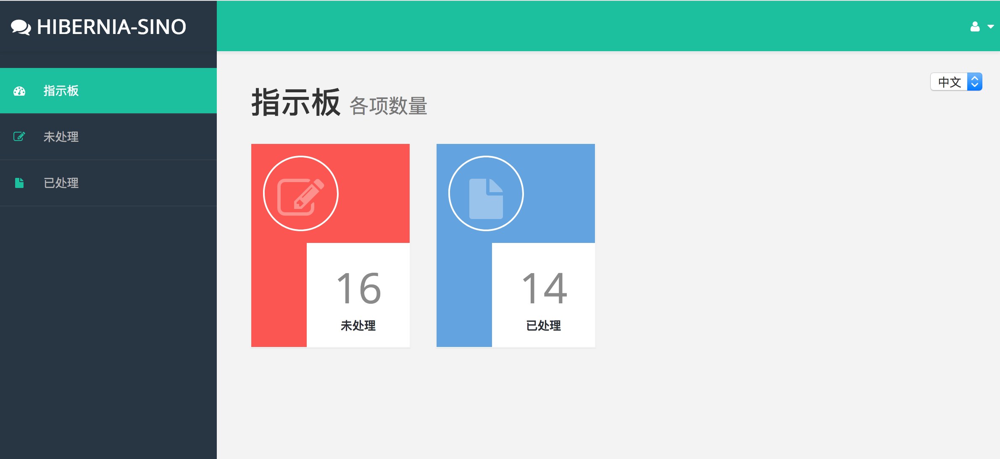
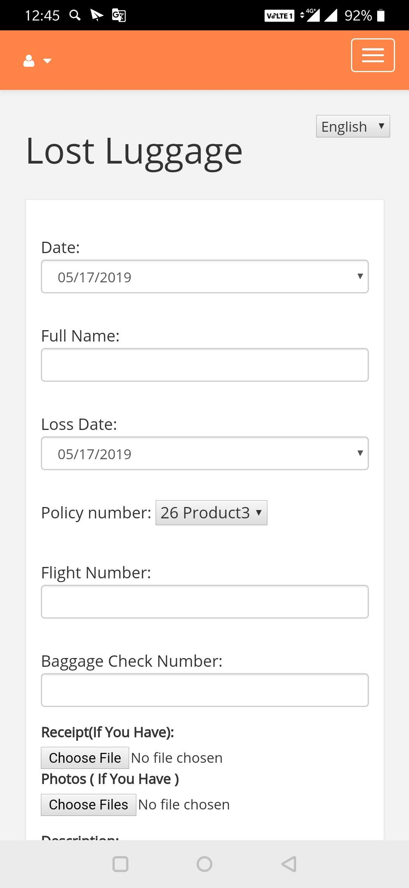

<style>
h1
{
	text-align:center;
}
p
{
	font-family: Times New Roman;
    font-size: 12pt;
    line-height:1.5;
}
figcaption {
    font: italic smaller sans-serif;
    padding: 3px;
    text-align: center;
    color: DarkGray;
}
.CodeMirror-code{
        font-size: 8pt;
}
figure{
    text-align:center;
}

[TOC]

# User Document

#1. Getting Started

## Overview

In this document, we will tell customers and employees how to use our application step by step. Our application is designed for customers and employees separately. Each of them has their own login entrance and different system logic.

## Install

To install our application, each customer and employee will be given to a link to download the installation package of our application. And it is very easy to install on their computers.

* For windows system, you would get a zip compress file. The only thing you need to do is extract it.

<figure>
  
  <figcaption>Fig.1 Install 1 </figcaption>
</figure>

* Then find the executed file and open it.

<figure>
  
  <figcaption>Fig.2 Install 2</figcaption>
</figure>

## Testing Account

### Test user account

* username:testuser   
* password:123456 

### Test employee account

* username:testemployee   
* password:123456 

#2. Customer

## Login

The user login window is on the left of the login interface. Customers input specific user-name and password set previously (registration) in entering the homepage and their account. Password can be modified later in their account.

<figure>
  
  <figcaption>Fig.3 User Login</figcaption>
</figure>

## Forget password

If customers forget their password, they can click the link at the bottom right of the login key "Forget Password?", then they would fill a form to reset the password. 
Customers should input their identification number (the system would check if the id is the same as when the account was registered to facilitate rest.) And the new password for two time, the new passwords must be the same. And they also need to input their email to receive the security code that the system sends to them. Then they input the security code and press the smile-face button. (the system would check if the security code is correct and return reset state) if correct. Customers' new password is set successfully.

<figure>
  
  <figcaption>Fig.4 Reset Password</figcaption>
</figure>

## Register

If customers are a new user of the website, they can click "Create New Account" link at the bottom left of the login key and fill the registration form. Customers should input their real name, gender and identification number for the system to authenticate.
Then customers should set their password for two time. The new passwords must be the same. And they also need to input their email to receive the security code that the system sends to them. Then they input the security code and press the smile-face button. (the system would check if the security code is correct and return reset state) if correct. The registration is finished successfully. (Each customer can only have one account)

<figure>
  
  <figcaption>Fig.5 Register</figcaption>
</figure>

## Apply for lost luggage

After login, user can press the luggage icon with "Luggage Lost" link and enter the filling claim page. In the form, user must fill the loss date, full name and select specific policy number bought by the customer before. 

Customers can also input flight number and baggage check number. These are optional. If customers have a receipt or photos of the luggage,  they can upload it. And input more detailed description of the luggage will be better.

<figure>
  
  <figcaption>Fig.6 Lost Luggage</figcaption>
</figure>

## Check the state of processing claims

Customer can check the sate of processing claims of lost luggage by clicking "Process Procedure" in the drop-down list, then it will show the number of processed claims and unprocessed claims, customers can click each icon to enter each interface and check the details and state of the claim. (click the item in the drop-down list can also enter these interfaces)

<figure>
  
  <figcaption>Fig.7 Process Procedure</figcaption>
</figure>

In the processed/unprocessed claim interface, the customer can check all processed/unprocessed claim he/she submit before. All information the customer gave is presented in the table, including the processing state (accept -> accept the claim; refuse -> refuse to the claim; request -> request for more information from the customer; waiting -> waiting to be processed in unprocessed interface )

<figure>
  
  <figcaption>Fig.8 Processed Claims</figcaption>
</figure>

<figure>
  
  <figcaption>Fig.9 Unprocessed Claims</figcaption>
</figure>

The customer can also click claimNo of each claim to check more details including all information filled before and feedback from the employee. Customers can also input some instrument or required information in the blank below and press the arrow button to submit. These information would be appended to the details.

<figure>
  
  <figcaption>Fig.10 Claim Details</figcaption>
</figure>

## Check my policies

Customers have two ways to check their policies bought before. In homepage, customer can press the "Access Your Policy" on the right to enter the interface. Or, if customers want to view policies when filling the lost-luggage claim, they can just click "Policies" in the drop-down list to enter the interface. 

<figure>
  
  <figcaption>Fig.11 Home</figcaption>
</figure>

<figure>
  
  <figcaption>Fig.12 Purchased Policies</figcaption>
</figure>

The customer can also click policyNo in the form to check more details about the insurance policy. 

## Third party login

If a customer does not have an account and he/she does not want to create a new one, he/she can sign in with their Google account as the third party account.

<figure>
  
  <figcaption>Fig.13 Log in</figcaption>
</figure>

## Share policies to social media

If customers want to tell their friends that our products are good, they can click the share buttons under the policy list in the policies interface and share their policies to social media such as Facebook, Twitter and so on.

<figure>
  
</figure>

<figure>
  
  <figcaption>Fig.14 Share</figcaption>
</figure>

## Language

Users can change language between English and Chinese in every page to meet their need, and the system will remember user’s first choice and convert to appropriate language.

<figure>
  
  <figcaption>Fig.15 Translation</figcaption>
</figure>

## User profile

After login, there is a little person icon at the top right of every page, by clicking the drop-down list, the user can log out or enter the personal information page. 

In this page, the user can view, modify or add personal information including identity number, email address and gender they filled before and additional information such as telephone number and address. Moreover, the user can also enter the reset page from this icon to modify their account password.

<figure>
   
  
  <figcaption>Fig.16 User Profile</figcaption>
</figure>

# 3. Employee

## Login

The employee login window is on the right of the customer login window. Every employee will be given an account at the very beginning when they work in the company. The account number is their job number, and the original password is 123456 which they can modify by themselves later.

<figure>
  
  <figcaption>Fig.17 Login</figcaption>
</figure>

## Forget Password

If employees forget their password, they can click the “Forgot Password” link to reset the password. They need to input their ID number and new password double time, and also need to input their email to receive the security code that the system sends to them. Then enter the security code, press the submit button and the new password is set done.

<figure>
  
  <figcaption>Fig.18 Reset password</figcaption>
</figure>

## Check the number of claims

Enter the dashboard interface the employee will see the number of unprocessed claims and processed claims. They can see the table of each kind of claims by pressing the icons.

<figure>
  
  <figcaption>Fig.19 Dashboard</figcaption>
</figure>

## Processing claims

To process a claim, employees can press the claimNo of this claim, and then it will skip to the processing interface. In this interface, employees can see the whole details of this claim, including the customer’s name, claim date, loss date, policy number, and describing details of his/her luggage. Then the employee can judge whether this claim could be approved or not, or maybe need more details. For the last option, employees can give some feedback to the customer to tell him/her what should him/her to add. 

<figure>
  
  <figcaption>Fig.20 Processing Interface</figcaption>
</figure>

## Language

Users can change language between English and Chinese in every page to meet their need, and the system will remember user’s first choice and convert to appropriate language.

<figure>
  
  
  <figcaption>Fig.21 Translation</figcaption>
</figure>

# 4. Mobile Platform

## Mobile-end

Customers can use all business of Hibernia-Sino Insurance Company abovementioned for smart phones. Customers using Android platform devices can login, change password, register new accounts, apply for lost luggage claims, and check claims or policies by proper application.

IOS users can use Hibernia-Sino Insurance service by Browsers, and can get functions and services that achieve the same effect.

<figure>
  
  <figcaption>Fig.22 Mobile-end</figcaption>
</figure>

