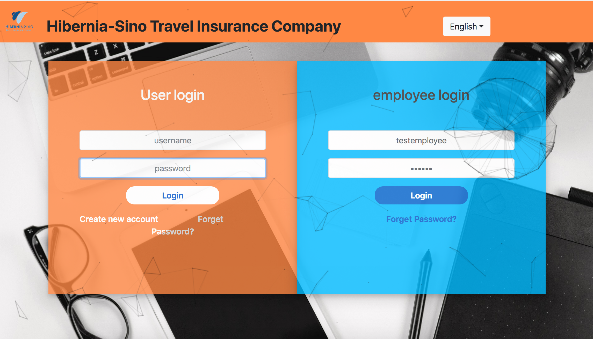
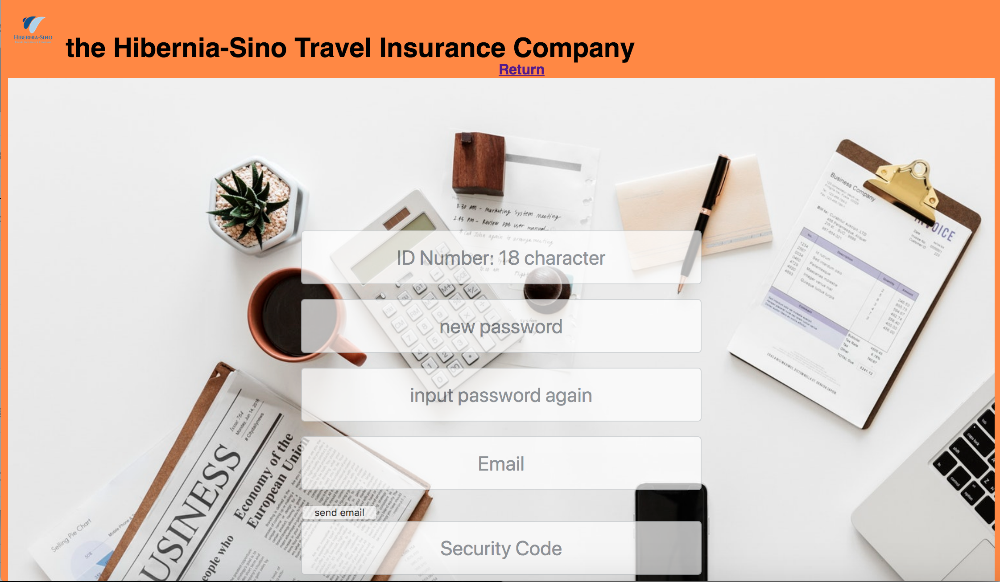

<style>
body
h1
{
	text-align:center;
}
p
{
	font-family: Times New Roman;
    font-size: 12pt;
    line-height:1.5;
}
figcaption {
    font: italic smaller sans-serif;
    padding: 3px;
    text-align: center;
}
.CodeMirror-code{
        font-size: 8pt;
}
figure{
    text-align:center;
}

# User Document

## 0. Getting Started

### Overview

In this document, we will tell customers and employees how to use our application step by step. Our application is designed for customers and employees separately, each of them have their own login entrance and different system logic.

### Install

To install our application, each customer and employee will be given to a link to download the installation package of our application. And it is very easy to install on their computers,

## 1. Customer

### Login

The user login window is on the left of login interface. Customers input specific user-name and password set previously (registration) in enter the homepage and their account. Password can be modified later in their account.

### Forget password

If customers forget their password, they can click the link at the bottom right of the login key "Forget Password?", then they would fill a form to rest the password. 

Customers should input their identification number ( the system would check if the id is the same as when the account was registered to facilitate reset. ) and the new password for two times, the new passwords must be the same. And they also need to input their email to receive the security code that the system send to them. Then they input the security code and press the smile-face button. ( the system would check if the security code are correct and return reset state ) If correct, customers' new password is set successfully.

### Register

If customers are new user of the website, they can click "Create New Account" link  at the bottom left of the login key and fill the registration form. Customers should input their real name, gender and identification number for the system to authenticate.

Then customers should set their password for two times, the new passwords must be the same. And they also need to input their email to receive the security code that the system send to them. Then they input the security code and press the smile-face button. ( the system would check if the security code are correct and return reset state) If correct, the registration is finished successfully. (Each customer can only have one account)

### Apply for lost luggage

After login, user can press the luggage icon with "Luggage Lost" link and enter the filling claim page. In the form, user must fill the loss date, full name and select specific policy number bought by the customer before. 

Customers can also input flight number and baggage check number, theses are optional. If customers have receipt or photos of the luggage,  they can upload it. And input more detailed description of the luggage will be better.

### Check the state of processing claims

Customer can check the sate of processing claims of lost luggage by clicking "Process Procedure" in the drop-down list, then it will show the number of processed claims and unprocessed claims, customers can click each icon to enter each interface and check the details and state of the claim. (click the item in the drop-down list can also enter these interface)

In the processed/unprocessed claim interface, the customer can check all processed/unprocessed claim he/she submit before. All information the customer gave is presented in the table, including the processing state (accept -> accept the claim; refuse -> refuse to the claim; request -> request for more information from the customer; waiting -> waiting to be processed in unprocessed interface )

The customer can also click claimNo of each claim to check more details including all information filled before and feedback from the employee. Customers can also input some instrument or required information in the blank below and press the arrow button to submit. These information would be appended to the details.

### Check my policies

Customers have two ways to check their policies bought before. In homepage, customer can press the "Access Your Policy" on the right to enter the interface. Or, if customers want to view policies when filling the lost-luggage claim, they can just click "Policies" in the drop-down list to enter the interface. 

The customer can also click policyNo in the form to check more details about the insurance policy. 

### Third party login

Customers can login using the third party account.
Customers have two ways to check their policies bought before. In homepage, customer can press the "Access Your Policy" on the right to enter the interface. Or, if customers want to view policies when filling the lost-luggage claim, they can just click "Policies" in the drop-down list to enter the interface. 

The customer can also click policyNo in the form to check more details about the insurance policy. 

### Third party login

Customers can login using the third party account.

### Share policies to social media

Customers can share their policies to social media such as WeChat

## 2. Employee

### Login

The employee login window is on the right of customer login window. Every employee will be given an account at the very beginning when they work in the company. The account number is their job number, and the original password is 123456 which they can modified by themselves later.

### Forget Password

If employees forget their password, they can click the “Forget Password” link to reset the password. They need to input their ID number and new password double times, and they also need to input their email to receive the security code that the system send to them. Then they enter the security code, press the submit button and then the new password is set done.

### Check the number of claims

Enter the dashboard interface the employee will see the number of unprocessed claims and processed claims. They can see the table of each kind of claims by pressing the icons.

### Processing claims

To process a claim, employees can press the claimNo of this claim, and then it will skip to the processing interface. In this interface, employees can see the whole details of this claim, including the customer’s name, claim date, loss date, policy number, and the describing details of his/her luggage. Then the employee can judge whether this claim could be approved or not, or maybe need more details. For the last option, employees can give some feedback to the customer to tell him/her what should him/her to add. 

## 3. Mobile Platform

### Mobile-end

Customers can use all businesses of Hibernia-Sino Insurance Company abovementioned by smartphones. Customers using Android platform devices can login, change password, register, apply for lost luggage, and check claims or policies by proper app.IOS also have corresponding app with all of this features 

