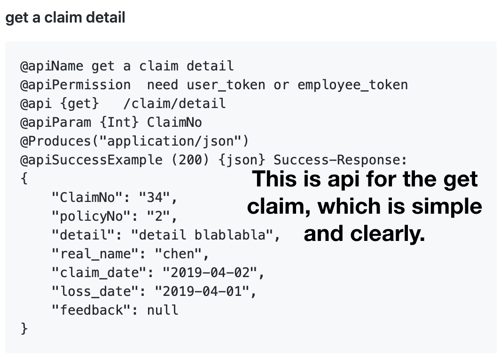
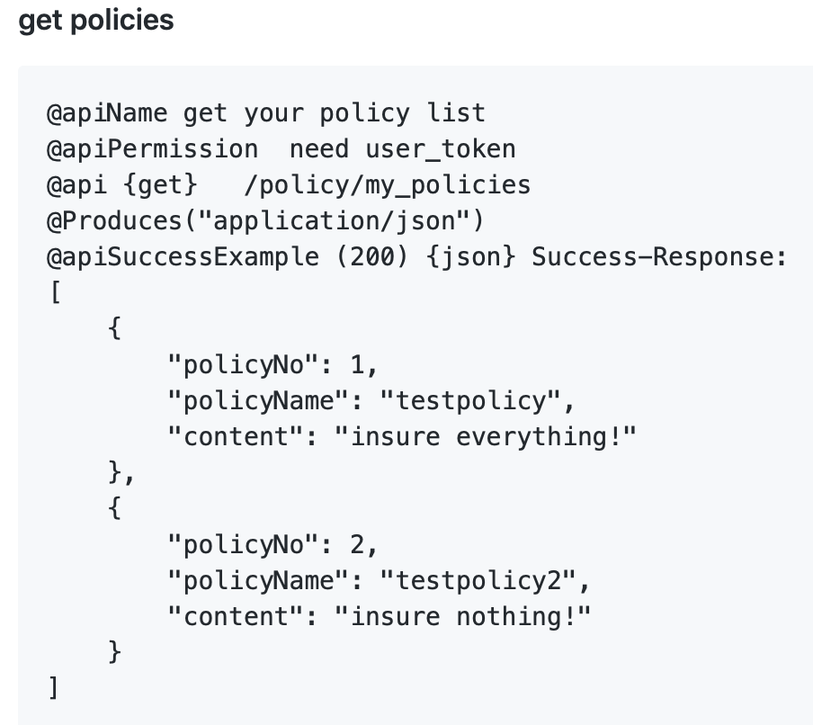
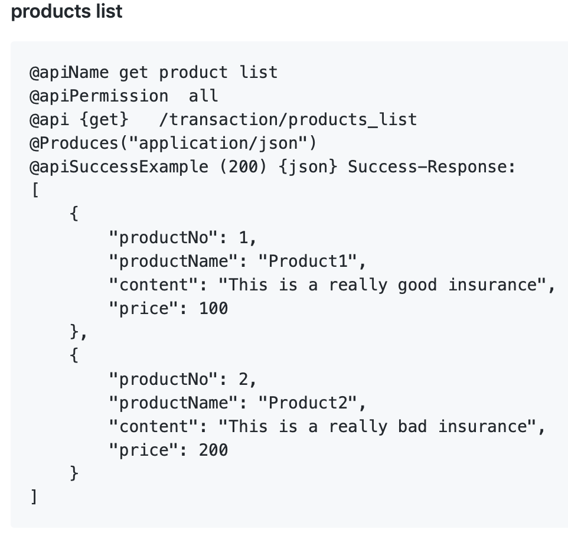
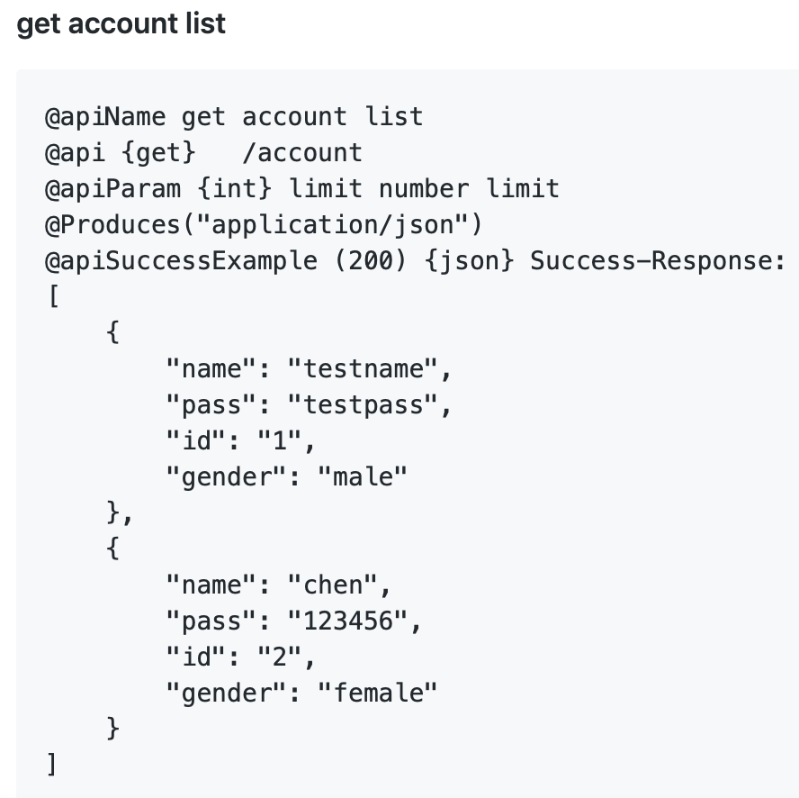
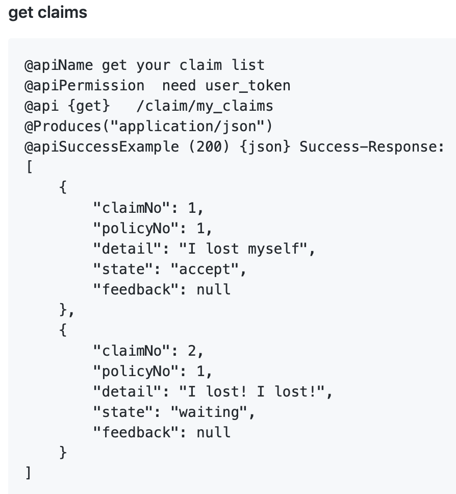
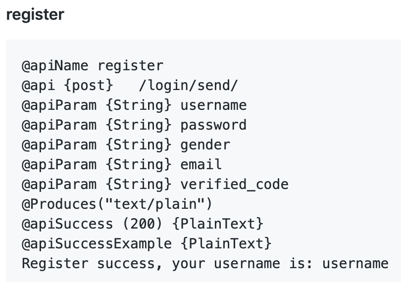
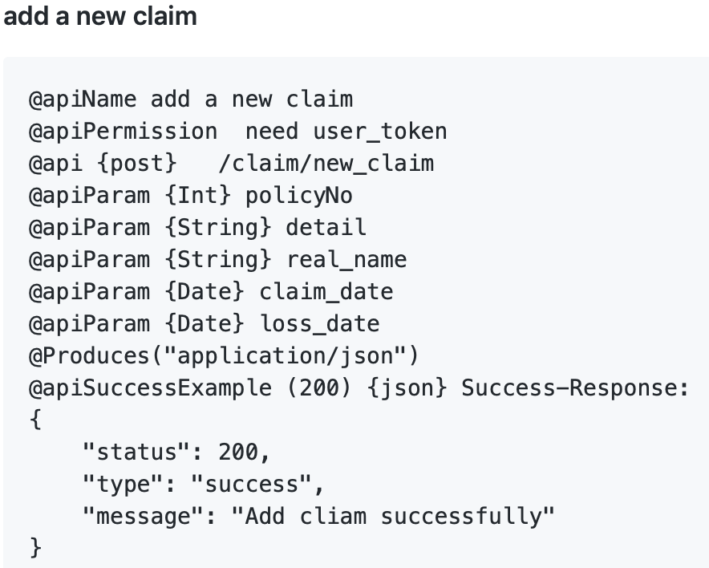
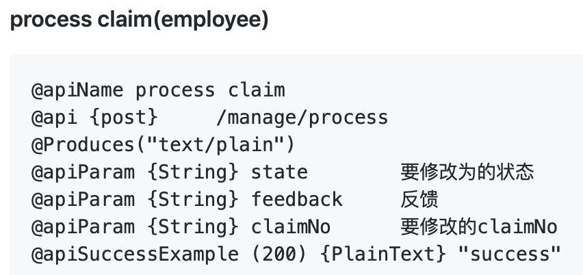
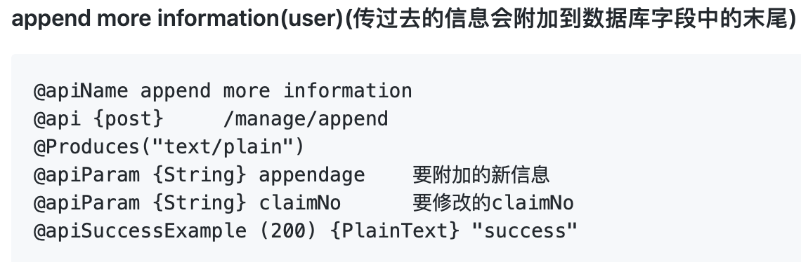

# Content

[TOC]

# 1. ABSTRACT

In this document, we talk about the detail about our Insurance project. It includes how our team to organize and how to teamwork and did the development process, and the technical detail behind the project. lastly, we do a brief conclusion about the project and analyze our gain and loss at this time.

# 2. INTRODUCTION

## 2.1 What does the system do

## 2.2 The plan of the system

# 3. GROUPWORK

## 3.1 How to achieve the goals together

As for the teamwork, we intend to have a high-efficient teamwork. To achieve this, we have three aspects of how to reach the goals together.

- Clear Responsibility

  A team is made up of individuals. Individuals in a team often have different experiences, personalities and programming levels. Before the official start, we firstly carry out a reasonable division of labor which combine each person's characteristics and hobbies, give full play to the strengths of each team member. If the work is not pleasant and smooth, the efficiency will be low. After the division of labor is completed, each team member's corresponding responsibilities are determined.

- Efficient Communication

  After the completion of the division of work, the team will start to work, it must ensure the smooth flow of information within the whole team, especially among the team members whose work are related to each other. When problems are found, they need to be discussed in time to avoid unnecessary time waste. However, software development itself is a kind of work that needs to be focused and quiet, and many temporary interruptions will lead to the stagnation of development ideas, so our team have discussions at a fixed time every week. And fixed time will also let everyone form a habit, so that the efficiency can be improved.

  At each meeting, we always discuss these aspects as flowing:

  - Conclude from last week’s work or presentation, and find ways to overcome.
  - Set goals of this week, including the integral goal and each team members’s goal for this week.
  - Solve some difficult problems those cannot be solved by one team member.
  - Write the meeting agenda.

- Appropriate Tools

  Tools are very important of an efficient teamwork.

  The approach that most teams are taking right now is to introduce collaborative software that works for the whole team. With clear responsibilities and efficient communications, if team members are supported and coordinated by appropriate team collaboration tools, this project will be carried out more smoothly.

  So we use GitHub to develop the project as it can provide each members to contribute for their own part on their own computer and it is easy to solve the conflicts by merging the code. 

  Also we use MarkDown to write our documents, because it can be modified by more than one team member at the same time, and after everyone done their part just merge it on GitHub, it is very convenient for a team to write documents. As our project is a software project, we need to write some code in the document, and MarkDown makes it is extremely easy and straight to inset the code into the document.

The team is an integrity , not a set of individuals, we should always remember that the ultimate effectiveness of the team depends on the lowest efficiency of the team. Reasonable division of labor is the prerequisite to prevent the occurrence of problems, and establishing of efficient communication mechanism is an effective way to find problems.

## 3.2 Divide of work

## 3.3 Problems

## 3.4 Solutions

# 4. TECHNICAL IMPLEMENTATION

## 4.1 Front-end

### 4.1.1 Logic

### 4.1.2 Connection between the front-end and the back-end

4.1.2.1 outline 


the connection between front-end and back-end we divide funtions into 3 different case, just like the diagram shows above. get objects with parameters, no parameters, and return a message.

4.1.2.2 functions that contains parameters and return a list of objects.




Get claims different from state.


And there the other functions using this pattern. To get product detail.

```java
get product detail

@apiName get a product detail
@apiPermission  all
@api {get}   /transaction/product_detail
@apiParam {Int} productNo
@Produces("application/json")
@apiSuccessExample (200) {json} Success-Response:
{
    "productNo": 1,
    "productName": "Product1",
    "content": "This is a really good insurance",
    "price": 100
}
```


```java
 	@GET
    @Path("/product_detail")
    public Response product_detail(@QueryParam("productNo") int productNo) throws SQLException {
        Connection conn;
        try {
            conn = new sqlpool().getSingletons().getConnection();
        } catch (Exception e) {
            MyMessage m = new MyMessage("sql fail");
            return Response.status(403).entity(m).build();
        }
        PreparedStatement ps = conn.prepareStatement("select * from Insurance_product where ProductNo=?");
        ps.setInt(1, productNo);
        ResultSet res = ps.executeQuery();
        if (res.next()) {
            Product product = new Product(res.getInt("productNo"), res.getString("productName"),
                    res.getString("content"), res.getDouble("price"));
            return Response.status(200).entity(product).build();
        } else return Response.status(403).entity("this productNo don't exist").build();
    }
```

```javascript
		let myArr;
        function buildHtmlTable() {
            let xmlhttp = new XMLHttpRequest();
            let url = "http://cccbd.top:8080/RESTHello/transaction/product_detail?productNo=" + getUrlParameter('productNo');
            xmlhttp.withCredentials = true; //!!
            xmlhttp.open("GET", url, true);
            xmlhttp.send();
            xmlhttp.onreadystatechange = function () {
                if (xmlhttp.readyState === 4 && xmlhttp.status === 200) {
                    myArr = JSON.parse(xmlhttp.responseText);
                    document.getElementById('productName').innerHTML = "Name:" + myArr['productName'];
                    document.getElementById('price').innerHTML = "Price:" + myArr['price'];
                    document.getElementById('content').innerHTML = "Content:" + myArr['content']+"<br>"+"ProductNo:"+myArr['productNo'];
                }

            };
        }
```

4.1.2.3 functions that has no parameters, and only request for database information.

In order to get many list. we send request to url and return a list that contains all the objects satisfy the constraints. 



Get products lists.



Get account lists.



get all claims.



above functions are get lists. And almost same jquery code.

following is dynamic generate options to offer customer to select your policy in create a new claim. 

```javascript
 function addOptions(selector) {
            $(selector).empty();
            let xmlhttp = new XMLHttpRequest();
            let url = "http://cccbd.top:8080/RESTHello/policy/my_policies";
            xmlhttp.withCredentials = true;
            xmlhttp.open("GET", url, true);
            xmlhttp.send();
            let myArr = '';
            xmlhttp.onreadystatechange = function () {
                if (xmlhttp.readyState === 4 && xmlhttp.status === 200) {
                    myArr = JSON.parse(xmlhttp.responseText);
                    var columns = addAllColumnHeaders(myArr, selector);
                    var row$ = $('<select/>');
                    for (var i = 0; i < myArr.length; i++) {
                        row$.append($('<option/>').html(myArr[i][columns[0]]+" "
                            +myArr[i][columns[1]]).attr('value',myArr[i][columns[0]]));
                    }
                    $(selector).append(row$);
                    row$.attr('name', 'policyNo')
                }

            };
        }
```


4.1.2.3 return a message telling us whether succsss.

Here are our send function, different from before. we need to send informations to database, username and password. database executeQuery and check whether this user have registered. 


register are same as login. In html, getElementById the user input. In JSON, package information as value with specific key name. Add a new claim, process claim(emoployee check claim), after read employee feedback, user append more information to the detail.









## 4.2 Back-end

### 4.2.1

### 4.2.2 

## 4.3 Mobile-end(金)

# 5. Conclusion

above are all of the porject informations that CCCBD company apply for Hibernia-sino Company. According to our group condition, we seperate into three group. All of us were done ourself job well and on time. 


