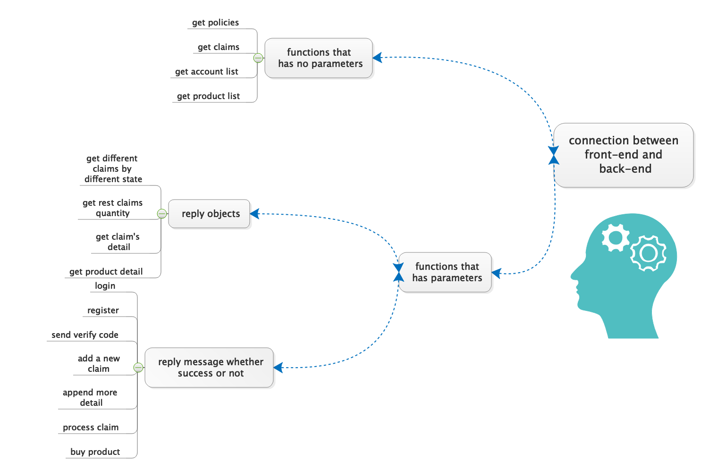
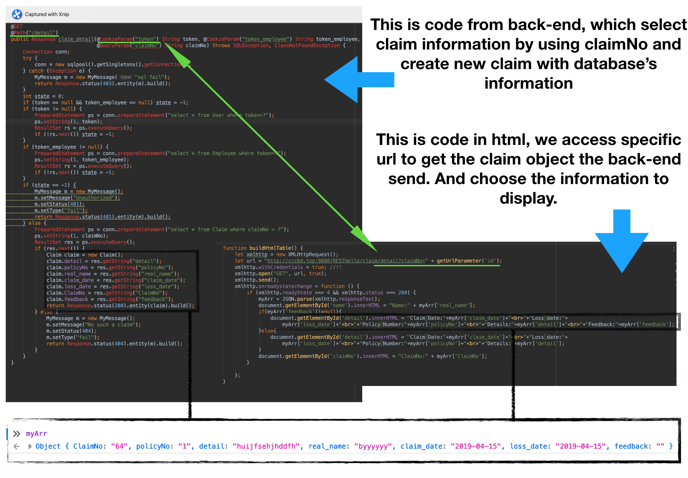
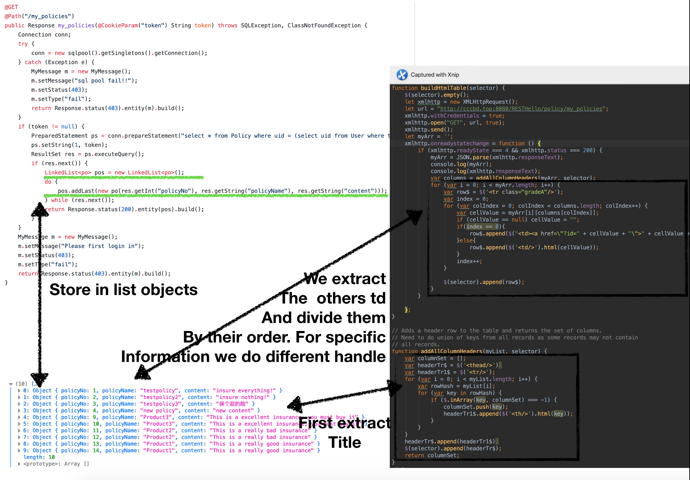
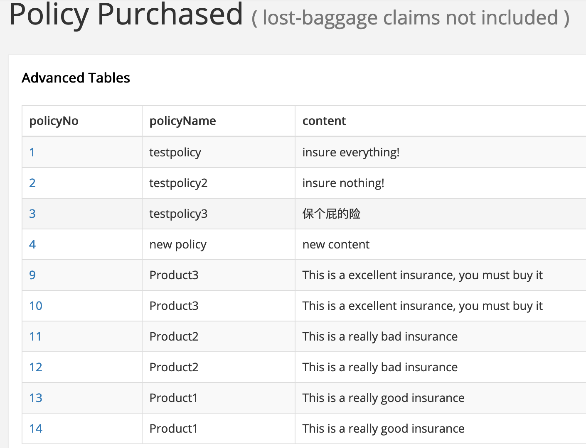
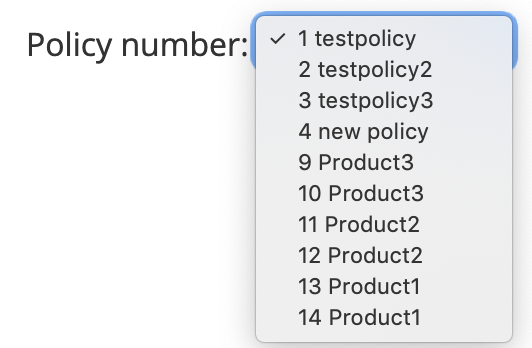
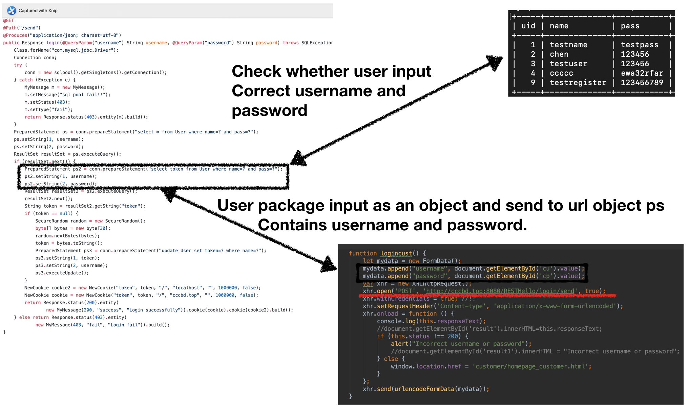

# Content

[TOC]

# 1. ABSTRACT(睿)

In this document, we talk about the detail about our Insurance project. It includes how our team to organize and how to teamwork and did the development process, and the technical detail behind the project. lastly, we do a brief conclusion about the project and analyze our gain and loss at this time.


# 2. INTRODUCTION(玥)

## 2.1 What does the system do

## 2.2 The plan of the system

# 3. GROUPWORK

## 3.1 How to achieve the goals together(杜)

As for the teamwork, we intend to have a high-efficient teamwork. To achieve this, we have three aspects of how to reach the goals together.

- Clear Responsibility

  A team is made up of individuals. Individuals in a team often have different experiences, personalities and programming levels. Before the official start, we firstly carry out a reasonable division of labor which combine each person's characteristics and hobbies, give full play to the strengths of each team member. If the work is not pleasant and smooth, the efficiency will be low. After the division of labor is completed, each team member's corresponding responsibilities are determined.

- Efficient Communication

  After the completion of the division of work, the team will start to work, it must ensure the smooth flow of information within the whole team, especially among the team members whose work are related to each other. When problems are found, they need to be discussed in time to avoid unnecessary time waste. However, software development itself is a kind of work that needs to be focused and quiet, and many temporary interruptions will lead to the stagnation of development ideas, so our team have discussions at a fixed time every week. And fixed time will also let everyone form a habit, so that the efficiency can be improved.

  At each meeting, we always discuss these aspects as flowing:

  - Conclude from last week’s work or presentation, and find ways to overcome.

  - Set goals of this week, including the integral goal and each team members’s goal for this week.

  - Solve some difficult problems those cannot be solved by one team member.

  - Write the meeting agenda.

- Appropriate Tools

  Tools are very important of an efficient teamwork.

  The approach that most teams are taking right now is to introduce collaborative software that works for the whole team. With clear responsibilities and efficient communications, if team members are supported and coordinated by appropriate team collaboration tools, this project will be carried out more smoothly.

  So we use GitHub to develop the project as it can provide each members to contribute for their own part on their own computer and it is easy to solve the conflicts by merging the code. 

  Also we use MarkDown to write our documents, because it can be modified by more than one team member at the same time, and after everyone done their part just merge it on GitHub, it is very convenient for a team to write documents. As our project is a software project, we need to write some code in the document, and MarkDown makes it is extremely easy and straight to inset the code into the document.

The team is an integrity , not a set of individuals, we should always remember that the ultimate effectiveness of the team depends on the lowest efficiency of the team. Reasonable division of labor is the prerequisite to prevent the occurrence of problems, and establishing of efficient communication mechanism is an effective way to find problems.

##3.2 Divide of work(杜)

Our team divide the project basicaly into three main parts: front-end part, back-end part and mobile-end.

* Front-end

  Contributors: Bi Yue, Du Xuanxuan, Cao Ziyi

  Main work: The design of the interfaces and the logic of the system, for example, what information does a customer need to apply for an account, what should a customer do if he/she forgets his/her password, what are the steps when a customer apply for a lost luggage and so on.

* Back-end

  Contributor: Chen Jingrui

  Main work: 

* Mobile-end

  Contributor: Chen Jin

  Main work: 

## 3.3 Problems(玥)

## 3.4 Solutions(玥)

# 4. TECHNICAL IMPLEMENTATION

## 4.1 Front-end

### 4.1.1 Logic

- Logic of customer-end.

  First the customer need to sign in, if the customer doesn’t have an account he/she can apply for one in the applying interface. The system will send an Ajax to the back-end for login request, and then the back-end will return a state code. In the customer_homepage interface customers can apply for lost luggage, buy new policies and check all the policies they have already bought. 

  In the lost luggage interface, customers can write claims by fill the forms, they need to input the date when they lost it, their real name, and their policy number. Also they can find the processing policies if they have more than one claim.

  <font color=#FF0000>  In the select product interface, </font> 

   

- Logic of the employee-end.

  Every employee will be given an account at the very beginning when they work in the company. Like the customer-end, they need to sign in and the system will send an Ajax to the back-end for login request, and then the back-end will return a state code. 

  In the dashboard the employee can see the number of processed and unprocessed claims. To achieve this, unprocessed will get the number of all the claims which state is ‘waiting’, and processed will get the number of the rest of them. To process the claims, the employee need to click the policyNo and then it will skip to the processing interface. In this interface, the whole details will be displayed to the employee and there are three buttons under the details, approve, deny, and ask for more information. Click the button and then will set the state to this claim, then skip to the Unprocessed interface, the number of unprocessed will minus one.   

  

### 4.1.2 Connection between the front-end and the back-end

#### 4.1.2.1 outline 



The connection between front-end and back-end we divide funtions into 3 different case, just like the diagram shows above. get objects with parameters, no parameters, and return a message.

#### 4.1.2.2 functions has parameters. 



we usally use this functions to get one object contains our desired informations. in the client-side we need specific different claims, quantity of claims and product's details. the problem in this stage, is we should hava correct api and clearly thought, using console.log print out the object to check. others funcitions, we only implement this function and using in corrent div to get we goal.

####4.1.2.3 Functions that has no parameters, and only request for database information.

In order to get many list. we send request to url and return a list that contains all the objects satisfy the constraints. 

in this function, we create list to store the information we selected and send to url. After receive lists in html, first we generate thead, and append tbody, dynamic generate in table.

Following is dynamic generate options to offer customer to select your policy in create a new claim. 

```javascript
 function addOptions(selector) {
            $(selector).empty();
            let xmlhttp = new XMLHttpRequest();
            let url = "https://cccbd.top:8443/RESTHello/policy/my_policies";
            xmlhttp.withCredentials = true;
            xmlhttp.open("GET", url, true);
            xmlhttp.send();
            let myArr = '';
            xmlhttp.onreadystatechange = function () {
                if (xmlhttp.readyState === 4 && xmlhttp.status === 200) {
                    myArr = JSON.parse(xmlhttp.responseText);
                    var columns = addAllColumnHeaders(myArr, selector);
                    var row$ = $('<select/>');
                    for (var i = 0; i < myArr.length; i++) {
                        row$.append($('<option/>').html(myArr[i][columns[0]]+" "
                            +myArr[i][columns[1]]).attr('value',myArr[i][columns[0]]));
                    }
                    $(selector).append(row$);
                    row$.attr('name', 'policyNo')
                }

            };
        }
```





####4.1.2.4 return a message telling us whether succsss.

Here are our send function, different from before. we need to send informations to database, username and password. database executeQuery and check whether this user have registered. 



Register are same as login. In html, getElementById the user input. In JSON, package information as value with specific key name. Add a new claim, process claim(emoployee check claim), after read employee feedback, user append more information to the detail.


## 4.2 Back-end

This section would describe the back-end's 

“Login” page which will be common for the Common Reporting
Gateway, the Authorities Info Exchange and the Resource Management Web applications
(that constitute the NSW Web interfaces). The main component is the login form, where
user needs to provide the credentials in order to be authorized to use the web
application.

### 4.2.3 Develop process

At the starting of the project, we firstly want to cooperate in the back-end development, 

### 4.2.4 The reason for choosing these technology stacks

Before we starting to

## 4.3 Mobile-end(金)

### 4.3.1

### 4.3.2

# 5. Conclusion

Above are all of the porject information that CCCBD company apply for Hibernia-sino Company. According to our group condition, we seperate into three groups. All of us were done ourself job well and on time. 


